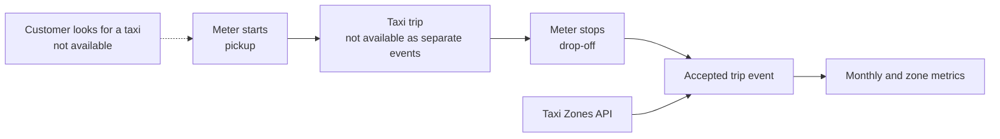
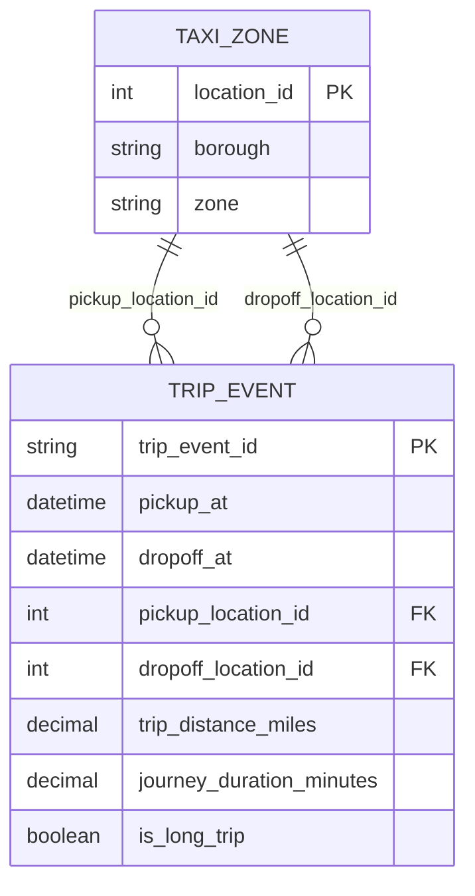

# Workflow and data model

## What the source lets me see



The dotted/“not available” parts are important. The file starts when the taxi meter starts, so I cannot calculate a real customer wait time. I calculate:

```text
journey duration = drop-off timestamp - pickup timestamp
```

## Simple model used in the pipeline



`fact_trip_events.csv` is my cleaned trip-event table. It has one accepted row per trip and includes the zone names from both joins. `rejected_trips.csv` is kept separately so I can see what did not make it into the metrics.

## How I would use the output

I would first look for pickup zones with both a reasonable number of trips and a high long-trip rate or P90 duration. I would then bring in another source, such as traffic, airport queue, roadwork, or route data, before proposing any intervention. This project is for finding where to look; it is not enough to say why the trip was long.
